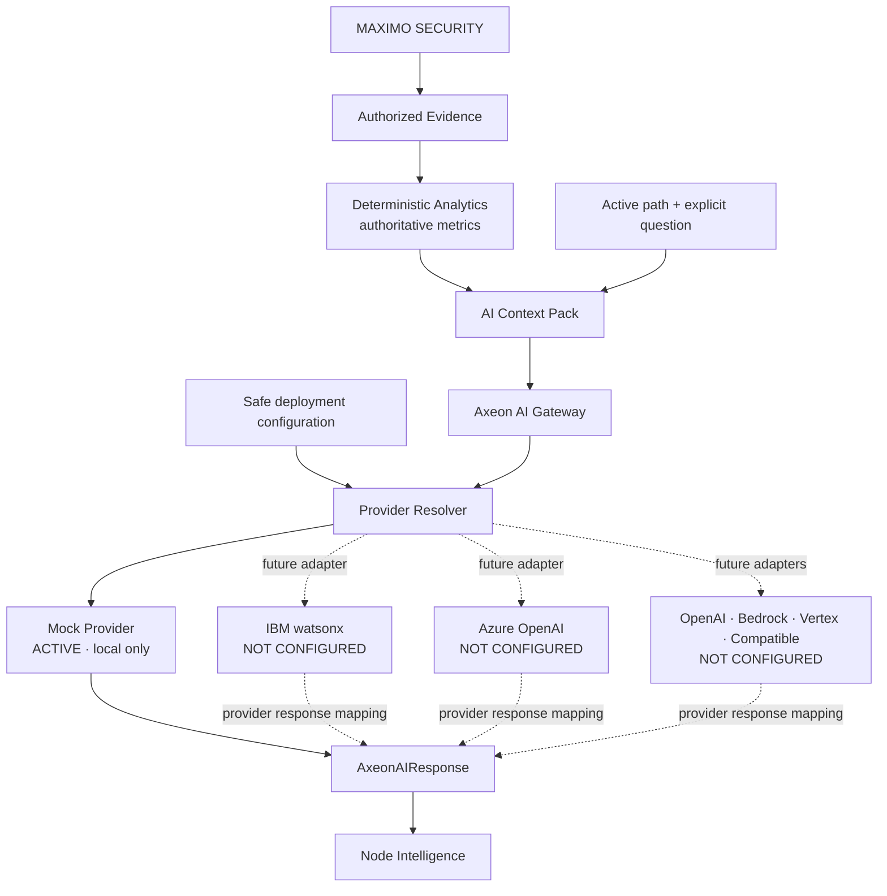

# AI Architecture — configurable provider routing (Task 014)

## Context Pack boundary

The pack contains the exact active path, context type/label/population, current deterministic findings, concise whitelisted aggregate evidence, current-user intent marker, normalized question, analytical reference time, and provenance. It excludes raw Work Orders, preview/CSV contents, saved investigations, candidates outside the active path, browser storage, credentials and arbitrary UI state. Text from Maximo and users remains untrusted data. A future system prompt must reject instructions embedded in those data fields.

## Contracts and invariance

`AxeonAIRequest` exposes no vendor model, temperature, token, URL or credential setting. `AxeonAIResponse` separates answer, finding references, next checks, limitations, grounding status and internal provider metadata. `AxeonAIGateway` remains the presentation boundary. `AIContextPack` is the one Axeon semantic input contract; there are no vendor-specific Context Pack types. Future adapters translate it after the gateway boundary and map provider output back to `AxeonAIResponse`, so provider payloads never reach React.

## Provider configuration and resolution

The registry uses stable IDs and safe capability/configuration metadata. Local status is honest: Mock is `active`; watsonx, Azure OpenAI, OpenAI, AWS Bedrock, Google Vertex AI, and Compatible Enterprise Provider are `not-configured`. `AxeonAIConfiguration` contains only `enabled` and `selectedProviderId`. The resolver has one executable factory, for Mock. Disabled or unconfigured resolution returns a controlled unavailable gateway and never silently substitutes Mock.

A compatible provider is an administrator-approved implementation of an Axeon-supported compatibility contract. It requires an allow-listed destination, TLS, server-side credentials, and response validation. It does not permit a user to supply an arbitrary URL.

## Authority, security and behavior

Deterministic analytics remain authoritative for metrics, thresholds, baselines, qualification and severity. Grounding, evidence references, limitations, authorization, and deterministic metric authority remain Axeon rules regardless of provider. AI cannot query Maximo, execute SQL, modify records, change the map, commit candidates or open records. Context Packs and responses are not persisted.

Production flow is **Browser → Axeon AI Gateway boundary → approved server-side integration → customer-approved provider**. Provider credentials and provider communication must remain outside browser-delivered code. Task 014 connects no real provider and makes no external AI request.

## Report interaction (Task 015)

Report generation never invokes the AI Gateway. `useAxeonAI` binds each ready response to its originating investigation path. The report builder may copy the provider-independent answer, grounding status, finding references, next checks and limitations only when that path exactly equals the report path. A stale, superseded, disabled or absent response produces no AI interpretation section. Deterministic findings remain visually and contractually separate from copied AI interpretation.

## Filter context (Task 016)

`AIContextPack.context.filters` carries normalized active filter metadata beside the exact committed or prospective path. It contains dimension/value constraints only, never raw records. Filter changes update the AI context key, discard an old answer, and require another explicit question. Providers receive the same provider-independent Context Pack. Reports include an existing AI answer only when both its path and filters match.

## Task 017 evidence provenance

The adapter security context now propagates through analytical evidence and Context Pack construction. This metadata does not authorize access; the future Real Adapter must authorize evidence first. Adapter selection, provider selection, and AI routing remain separate fail-closed boundaries.

## Task 020 AI data protection

The Context Pack remains the minimum authorized information needed for one explicit question: exact represented path/filter context, population, concise deterministic findings, scope marker, reference time, and normalized question. It never contains raw records, browser storage, exports, credentials, or unrelated candidates. Context Pack values remain data; a future provider prompt must reject instructions embedded in Maximo or user content. The local Mock provider makes no network call, and Context Packs/answers are neither persisted nor logged.

## V1.1 server gateway transition

The browser Context Pack remains an Axeon semantic contract. In network deployment, the server authenticates and authorizes the request, rebuilds or validates the minimum context from authorized DTOs, and then calls an approved provider gateway. Provider secrets, provider-specific requests, and provider network communication remain server-side. AI cannot access Maximo, Db2, SQL Server, or generated SQL directly.
