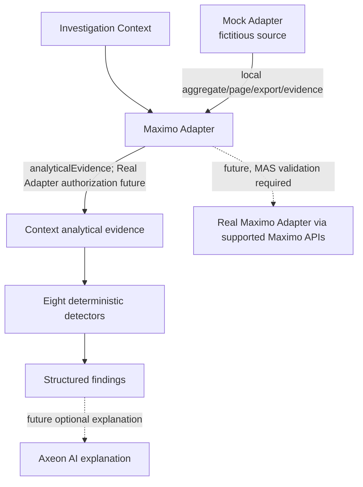

# Analytical architecture — eight deterministic lenses (Task 012)

The local Mock Adapter holds 2,000 deterministic, fictitious Work Orders. Task 009 added evidence fields, Task 010 added the first four service-level detectors, Task 011 exposed qualifying findings, and Task 012 completes deterministic coverage for the eight approved lenses. Existing aggregate, preview, and CSV response shapes remain unchanged. No AI answer or explanation is exposed in the UI.

## Approved evidence mapping

| Lens | Current synthetic evidence | Boundary still needed for later analysis |
| --- | --- | --- |
| Backlog & Aging | Report date, current status and status date, target dates, lifecycle actuals | Authorized context; business thresholds and status semantics |
| Repeat Work | Asset, location, work type, Work Order history, report/actual timing | Authorized historical window and repeat criteria |
| Process Bottleneck | Current status, status date, lifecycle dates, work type, site | Full status-transition history for detailed process timing |
| Work Mix | Work type, priority, status, classification, site | Authorized population and comparison period |
| Reliability | Asset, reactive work type, classification, report timing and broader Work Order history | Failure-code/problem/cause/remedy evidence remains absent |
| Risk | Priority, unresolved lifecycle, age and target dates | No safety, finance, regulation, consequence or failure probability evidence |
| Data Quality | Asset reference completeness for reactive work | Initial rule does not assess every Maximo data-quality dimension |
| Optimization | Reactive work share and asset concentration | Evidence indicates where to investigate; it does not prescribe action |

No labor, material, cost, SLA, or failure-reporting model was added.

## Future authorized flow

The eventual Real Adapter must apply the current user's Maximo authorization to evidence and counts **before** analytics run. The current-user scope marker is preparation, not enforcement. An LLM must not calculate basic facts that deterministic analytics can derive from authorized evidence. The Mock Adapter's Task 010 retrieval contract is local; enterprise retrieval limits, server-side calculation, and supported MAS integration remain future design decisions under AX-DEP-001. Saved investigations store path/filter metadata only; they do not persist evidence or confer access.

## Deterministic Analytics Engine I (Task 010)

`analyzeContext(adapter, path, filters)` requests the exact structured path/filter context plus current-user scope marker through `AnalyticalEvidenceAdapter`. The adapter returns context-filtered evidence, a baseline count summary from the same authorized population, and reference time. Eight independent pure detectors return structured findings; an empty array is valid. The UI invokes it only for the active non-root or filtered-root Node Intelligence context. The local reference is fixed at `2026-09-01T00:00:00.000Z`; a Real Adapter may supply an appropriate server reference time. No `Date.now()` is used by the rules.

## Active-context presentation (Task 011)

Node inspection determines one active structured path. The findings hook analyzes only that path: committed current context, or the selected candidate's prospective path. A root-only startup path is skipped. Path-keyed requests prevent unrelated renders and Inspect → Explore on the same path from triggering duplicate analysis. On context change, the panel moves immediately to loading; effect cleanup discards old completions. Retry reuses the active path, and Saved/Recent resume explicitly re-evaluates it. No candidate-wide analysis or findings persistence is added.

Node Intelligence renders Operational Findings separately from Questions to Investigate. A compact line uses the finding's lens, title, metric, population/baseline, threshold, and rule-provided severity. A native disclosure shows rule ID, structured evidence and reference date, without raw Work Order rows. Successful `[]` means only that none of the eight current rules qualified. Open Records remains a broader context preview. The future Axeon AI explanation boundary remains distinct from deterministic findings.

| Lens | Input | Rule and threshold | Baseline | Structured output | Limitations |
| --- | --- | --- | --- | --- | --- |
| Backlog & Aging | WAPPR with no actual start/finish; report, current status and target finish dates | Both report age and current-status age at least 90 elapsed days; target finish strictly before reference; at least 3 qualifying orders | All WAPPR orders without actuals in exact context | Qualifying/population counts, percentage, oldest current-status age, threshold | Initial approval backlog rule only; no SLA, trend, or full status history |
| Repeat Work | CM/EM, nonblank asset, report date | At least 12 reactive orders per asset reported within the preceding 31 days (inclusive) | All recent reactive orders with usable assets in exact context | Asset, repeat count, CM/EM composition, earliest/latest report dates | Same asset does not establish same failure or failed intervention; no failure codes |
| Process Bottleneck | WSCH PM with no actual start; current status date | Current WSCH duration at least 75 elapsed days; at least 3 qualifying orders | All unstarted WSCH PM in exact context | Qualifying/population counts, longest current-status duration, status/work type | Current stage dwell only; no transition history or root-cause claim |
| Work Mix | PM planned; CM + EM reactive | At least 30 eligible orders in context and baseline; reactive share at least 10 percentage points above baseline | Adapter-supplied PM/CM/EM counts from the current user's authorized population | Planned/reactive counts and percentages, baseline percentage, difference | Snapshot comparison only; no trend, causal claim, or hidden organization-wide baseline |
| Reliability | CM/EM, usable asset and report date in 180 days | At least 35 reactive orders for one asset across at least three 60-day periods | Exact authorized context | Asset, count, active periods, work-type/classification mix and range | No predicted failure, MTBF, root cause, probability or health score |
| Risk | Priority 1, unresolved, no actual finish, aged and target overdue | Age at least 60 days and at least 8 qualifying orders | High-priority unresolved population in exact context | Counts, percentage, oldest age and overdue count | Observable exposure only; no safety, finance, regulation or probability claim |
| Data Quality | Reactive CM/EM and asset reference | At least 8 missing assets and at least 5% of reactive population | Reactive population in exact context | Field, count, population and percentage | Asset completeness only; valid lifecycle nulls are not defects |
| Optimization | Work mix and usable reactive assets | At least 100 reactive, at least 80% reactive, top 3 assets at least 28% of reactive | Exact context and authorized work-mix baseline | Concentration, reactive population/share and top assets | Investigation opportunity only; no score or prescribed action |

Severity is rule-based: `attention` for any qualifying result; `elevated` at aged count ≥20, repeat count ≥15, scheduled PM count ≥8, or reactive-share difference ≥15 percentage points. No result is emitted below the finding thresholds. Findings contain stable rule/finding IDs, exact path, metric, affected and population counts, thresholds, reference time, and aggregate evidence metadata. They contain no raw Work Order arrays or AI-generated prose.

Advanced severity remains rule based: Reliability is elevated at 45 orders, Risk at 15 orders, Data Quality at 10 percent, and Optimization at 35 percent concentration; otherwise a qualifying result is attention. Results sort by elevated, attention, info, then stable lens/rule order. The panel initially shows five and provides View all/Show fewer controls, so findings are not silently discarded. No result is emitted below its thresholds.

The Mock Adapter filters context evidence before returning it and computes the baseline from its whole fictitious authorized population. That mock scope is not real Maximo security. The future Real Adapter must authorize both context evidence and baseline **before** analysis, preferably using server-side or aggregate retrieval for large populations rather than transferring all Work Orders into the browser. No analytical data is stored in localStorage.

## AI consumption boundary (Task 013)

Deterministic findings are copied into the AI Context Pack only after explicit user action. The pack retains calculated metrics, thresholds, affected/population counts, comparisons, stable finding IDs and a concise lens-specific subset of aggregate evidence. Detector rules and values are not recalculated by the provider. The Mock AI Provider may explain these facts or state evidence limitations; it cannot alter them. See [AI Architecture](ai-architecture.md).

## Filtered analytical evidence (Task 016)

The active structured filters travel with the path in the single analytical-evidence request. The adapter constrains evidence before all eight unchanged detectors run. Findings retain the normalized filter set as context metadata; a filter can remove a formerly qualifying finding without changing thresholds. The authorized baseline remains adapter supplied and cannot include records outside the user's future Real Maximo scope.
