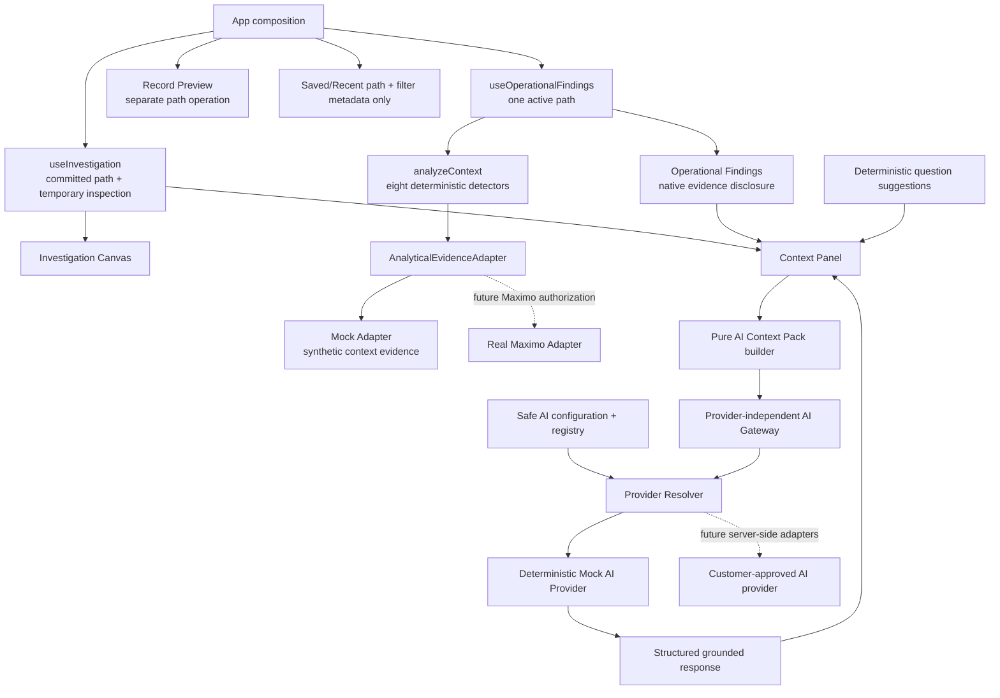
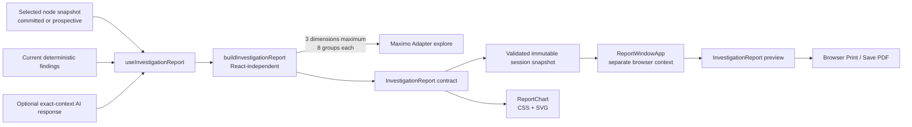
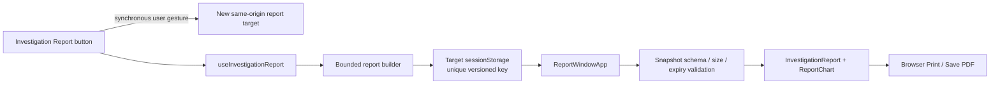
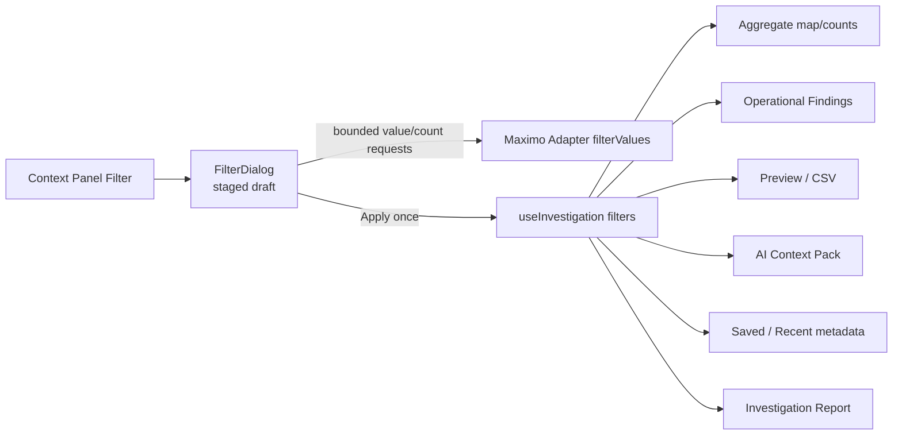
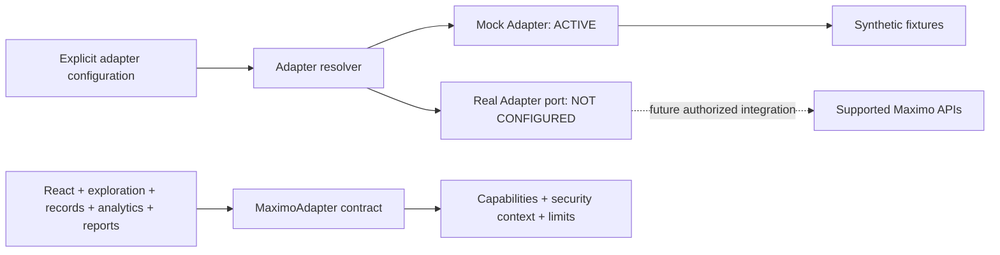
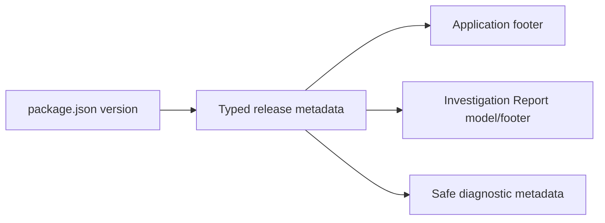
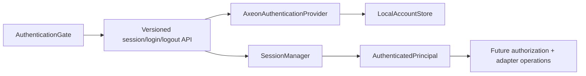

# Component architecture — active Node Intelligence (Task 011)

The selected `InvestigationNode.path` is the single source of context for both findings and questions. Inspection provides a prospective path without changing the committed spine. Findings are loaded asynchronously and guarded against stale responses; the panel remains usable while they load. Questions are deterministic prompts and remain distinct from calculated findings. Open Records continues to use the Context Panel path and does not filter by finding. No UI component imports the raw synthetic source or implements detector rules.

All detectors return the same `AnalyticalFinding` model. The orchestrator sorts by rule-provided severity and stable lens/rule order. `OperationalFindings` initially renders five results and exposes the rest through a compact View all control; native evidence disclosures reuse aggregate metadata for every lens. The component neither recalculates severity nor ranks with AI.

`useAxeonAI` receives the selected node and already-loaded finding state. It creates no request until a question is explicitly submitted, then calls only the injected `AxeonAIGateway` contract. It owns loading/error/Retry and invalidates stale responses by question token and context/revision key. `AxeonAIResponse` renders the provider-neutral contract separately from Operational Findings. No React component imports a vendor SDK or raw Work Order source.

Task 014 adds `AxeonAIConfiguration`, the safe provider registry and `resolveAxeonAIRuntime` at the composition boundary. `AIProviderStatus` renders registry/runtime status only. React contains no vendor request translation or vendor selection branches. When execution is disabled or unavailable, the panel disables AI actions while deterministic findings and all investigation components continue normally. Future adapters translate after `AIContextPack` and map back to `AxeonAIResponse`.

## Investigation Report components (Task 015)

The App provides a snapshot of `InvestigationNode.path`, label/type/count, ready exact-path findings and any ready AI response with its originating path. The builder does not receive reducer state, candidates, saved/recent data, record preview state or DOM information. The report hook synchronously opens a lightweight target, then owns preparation and safe Retry without changing source-tab state. `ReportWindowApp` validates and renders only the keyed snapshot; closing the separate context never drives investigation state. Chart rendering consumes only report chart DTOs. No component calculates detector qualification or makes an AI request.

## Separate report window components (Task 019)

`main.tsx` uses the internal report hash to choose the report-only surface instead of mounting the investigation shell. The hash carries only an opaque report ID. Each opened target owns an immutable report instance; source-tab rerenders and subsequent reports cannot replace it.

## Contextual Filter components (Task 016)

Filter state is sibling state to the committed reducer path. It is never rendered as a node. Chips expose the active set separately, and the dialog owns edits until Apply.

## Maximo Adapter port (Task 017)

Only the Mock implementation imports synthetic records. Product components depend on the port and normalized response DTOs.

## Product identity components (Task 018)

Presentation components contain no independent version literal. Diagnostic metadata is an internal contract and exposes no operational data or secrets.

## Task 020 safety components

## Authentication components (Task 023)

`AuthenticationGate` is the only browser authentication integration. It presents the local sign-in page until `GET /api/v1/session` resolves an active server session, retains the CSRF token only in component memory, and exposes a native sign-out control. The React investigation and report surfaces remain unchanged children of that gate. Local password authentication and future OIDC/SAML authentication conform to the provider-independent server port; the provider does not reach Maximo or a database.

`support/logger.ts` is the single structured diagnostic entry point. React components continue consuming normalized DTOs and generic safe errors; they do not log raw values or render untrusted HTML. The unused global “COMING LATER” command-bar placeholder was removed from the application shell because contextual Node Intelligence is the implemented AI entry point.
