# Data Flow — local record pagination and export (Task 007A)

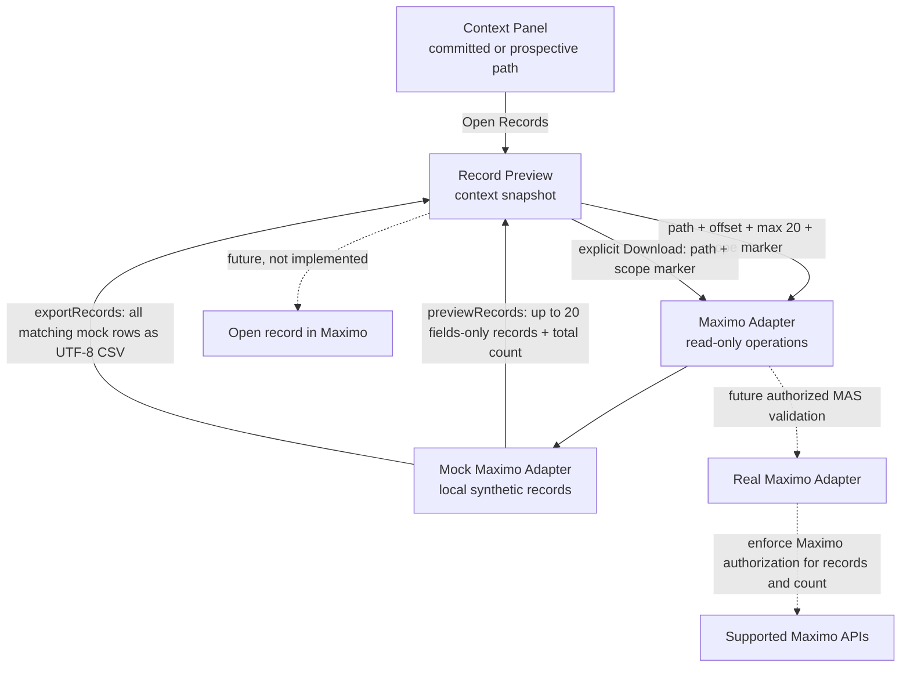

Preview retrieval and export retrieval are separate. The Mock Adapter filters and bounds each 20-record page before returning it; explicit export produces all matching fictitious records as CSV. Neither opening nor paging triggers export. The current-user marker is preparation, not security enforcement. Opening, paging, downloading, and closing do not change the committed path or selected candidate. The future Real Adapter must authorize both page results and exports through supported Maximo mechanisms and honor AX-DEP-001; neither that integration nor Maximo record navigation exists locally.

## Saved investigation flow (Task 008)

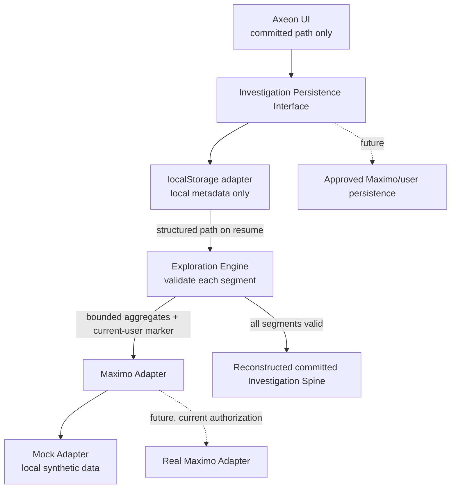

The saved path grants no data access. Invalid or unavailable segments leave the current spine intact. Recent paths use the same metadata boundary and are limited to five. The future persistence mechanism is undecided and must honor AX-DEP-001.

## Analytical evidence preparation (Task 009)

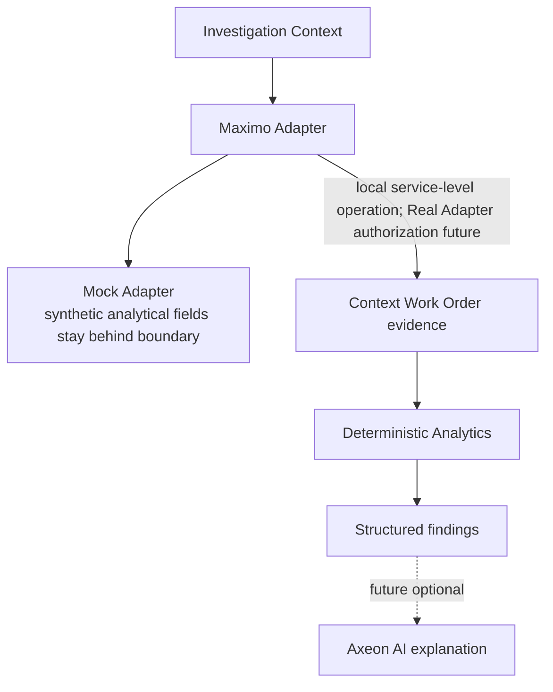

At Task 009, the adapter exposed only aggregate exploration, bounded preview, and explicit CSV export. Task 010 adds a separate service-level analytical evidence operation; preview/export DTOs still exclude analytical fields. A future Real Adapter must filter evidence to the current user's authorized Maximo context before any calculation. Enterprise retrieval limits require authorized MAS validation. See [analytical architecture](analytical-architecture.md) for rules and field mapping.

## Service-level analytical flow (Task 010)

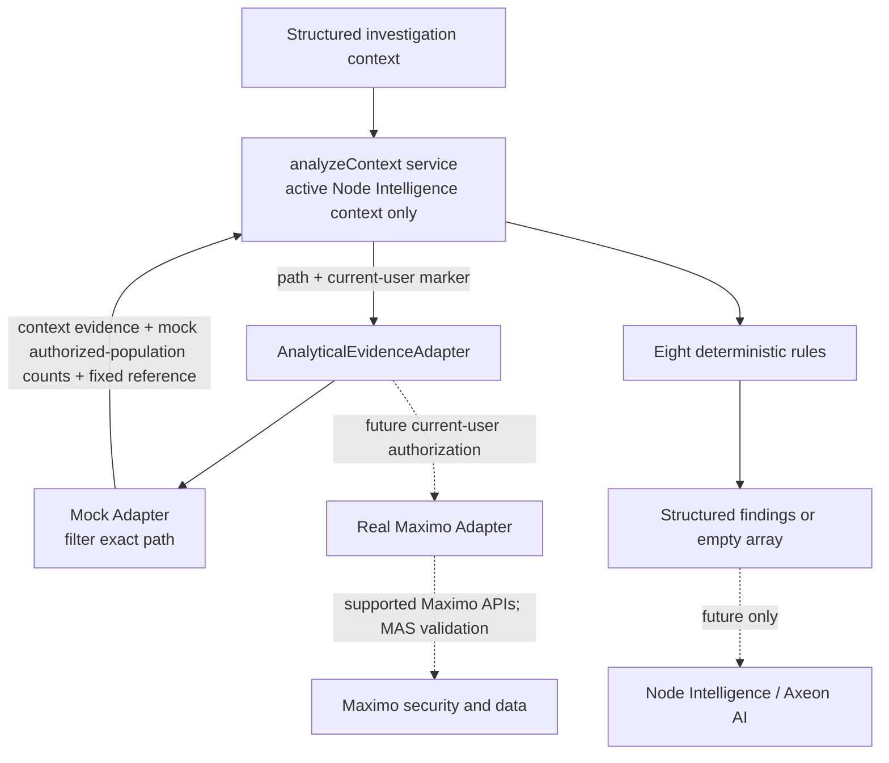

The Mock Adapter's analytical call is independent of ordinary aggregate, preview, and export calls. It runs for the one active non-root or filtered-root Node Intelligence context, never all candidate nodes or the unfiltered root at startup. The Real Adapter must authorize **both** context evidence and baseline counts before the service evaluates rules; post-analysis hiding is insufficient. For large enterprise populations, prefer server-side or aggregate calculation where supported. No analytical evidence/findings enter localStorage.

## Contextual findings flow (Task 011)

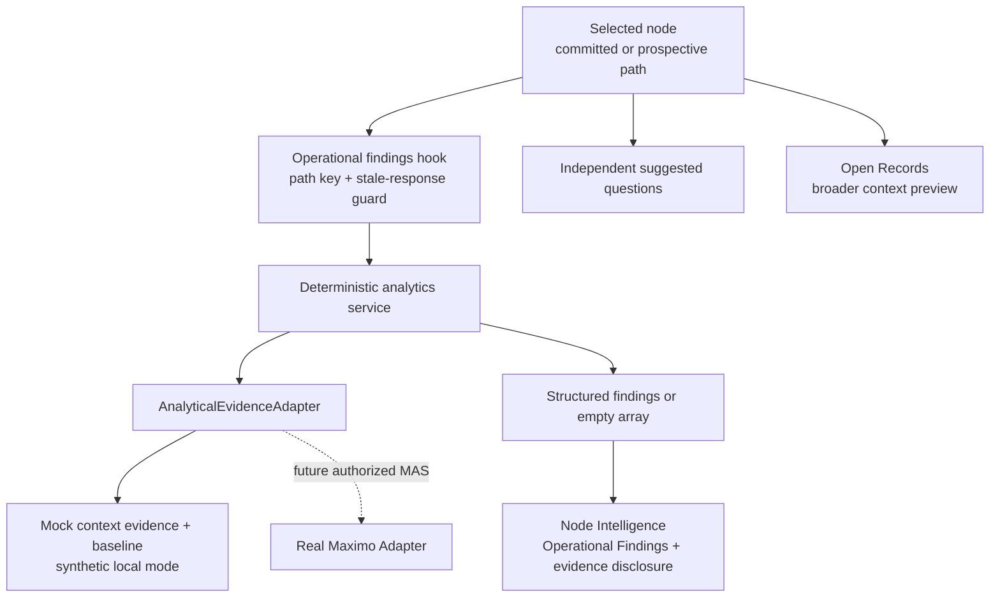

The committed breadcrumb/spine do not change on candidate inspection. Loading, error, Retry, and result state are confined to the findings section; Open Records and exploration stay independent. The same path is re-evaluated after Saved/Recent resume rather than restored from storage.

## Advanced analytics flow (Task 012)

One `analyticalEvidence` request supplies the active authorized context to Backlog & Aging, Repeat Work, Process Bottleneck, Work Mix, Reliability, Risk, Data Quality, and Optimization detectors. No detector performs its own fetch. Qualifying findings use one shared contract and deterministic ordering; the panel limits the initial presentation without discarding returned results. Preview, pagination, CSV export, aggregates, and saved-path metadata remain separate flows.

## Explicit grounded question flow (Task 013)

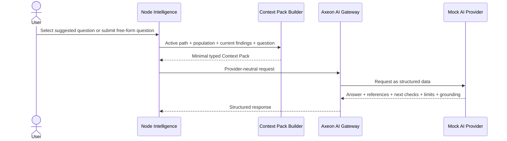

No request occurs when suggestions render, findings load, nodes load, or the app starts. The Context Pack contains no raw records or persisted library data. A changed context or newer question invalidates an older response. Suggested next checks do not execute UI or Maximo actions.

## Configured provider routing (Task 014)

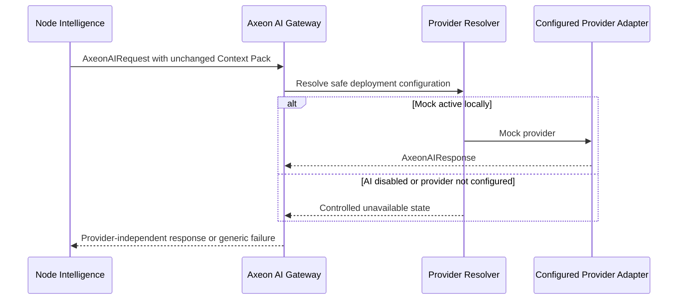

Configuration resolution never adds records, saved paths, credentials or endpoints to the Context Pack. Future provider-specific translation occurs after the Axeon contract and must run server-side when credentials or provider communication are involved. An unconfigured provider produces no request, answer or Mock fallback.

## Contextual Investigation Report flow (Task 015)

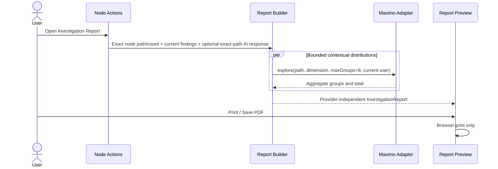

The builder makes at most three bounded aggregate requests and does not call preview, export, analytical-evidence or AI operations. Existing findings are copied only when their path exactly matches. An existing AI response is copied only when its originating path exactly matches; otherwise the AI section is absent. No report data is stored in localStorage. Report opening and printing do not dispatch investigation actions.

## Separate report handoff (Task 019)

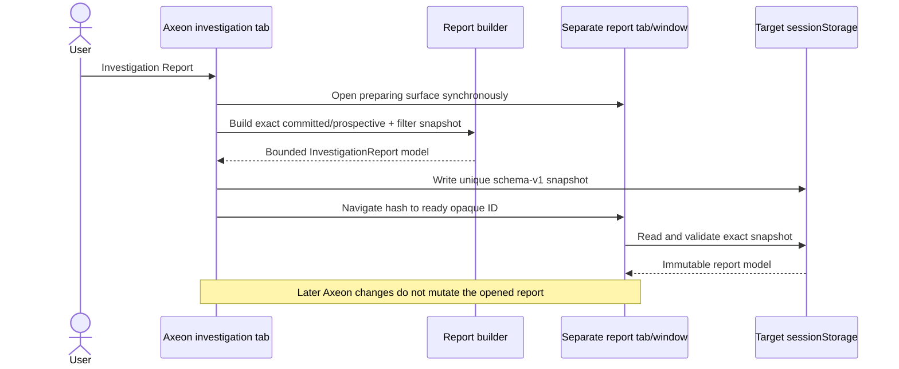

The URL contains the report mode and opaque ID only. No path, filter, finding, AI content, security metadata, record collection, token, or credential crosses through the URL. Missing or invalid snapshots stop at the report error surface; they never invoke an unrestricted/root report request.

## Contextual filter flow (Task 016)

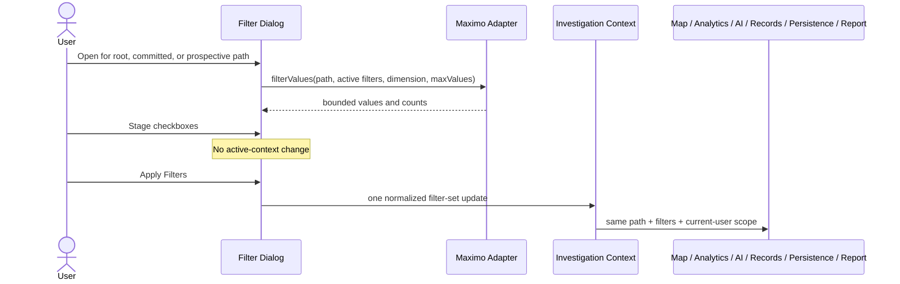

Path constraints and different filter dimensions combine with AND. Values within a filter dimension combine with OR. Preview remains 20 records per page; CSV export is separate and explicit. Filter discovery returns aggregates and never raw Work Orders.

## Hardened adapter flow (Task 017)

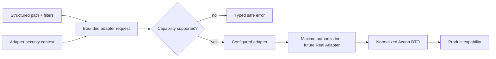

Invalid context never falls back to root. Filter discovery, aggregates, preview pages, export, analytical evidence, and report aggregates share the same path/filter/security contract. Only explicit export is unpaged and remains a separate authorized adapter operation.

## Task 020 protection lifecycle

The same authorization-first flow applies to every data use: authorized adapter DTOs feed bounded aggregates, preview/export, deterministic analytics, reports, and optionally a minimal Context Pack. Client persistence is metadata-only; report snapshots are bounded presentation handoffs. No raw Work Order collection is written to browser storage, placed in a URL, logged, or sent to the local Mock AI provider.

## AX-022 server ingress

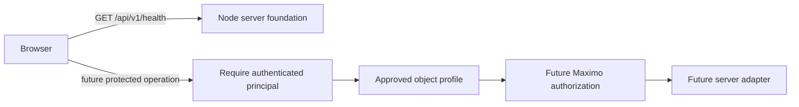

Only the health branch exists in AX-022. The protected branch is a fail-closed contract and does not invoke adapters, databases, Maximo, or AI.

## AX-024 local synthetic database proof

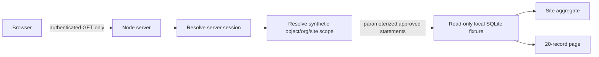

The browser cannot send SQL, a table name, authorization scope, or a database path. The fixture is initialized separately from the shared 2,000-record deterministic generator. Scope is resolved from the authenticated principal before every statement and may only be narrowed by an optional validated Site query parameter. This is a local authorization-placement proof; future Db2, SQL Server, and Maximo API flows require independent current-user Maximo authorization validation.

## AX-025 future approved connection flow

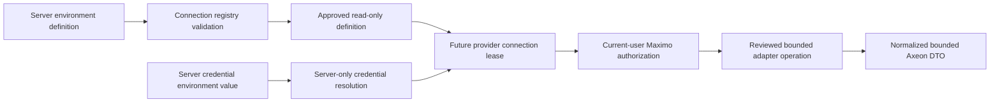

AX-025 implements only validation and contracts. It creates no lease, sends no request, and executes no database/API operation. The browser never receives the definition's credential value or any connection capability.
