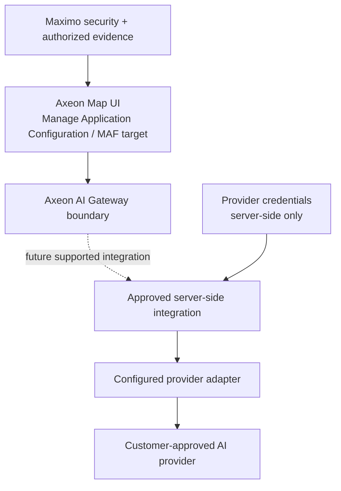

# Deployment Architecture — provider foundation (Task 014)

Task 014 implements the browser-side provider-independent contracts, safe registry/configuration, resolver, local Mock route and status surface only. It does not implement the production server, credentials, authentication, network communication or any real provider adapter.

AX-DEP-001 requires supported Maximo Manage Application Configuration/MAF and Manage configuration/publishing without Maximo core modification or a customer-performed Manage build/redeploy. The exact gateway hosting/integration mechanism, each provider adapter and this deployment target require validation in an authorized MAS environment. No technical MAS validation is claimed.

Production provider secrets must remain outside browser-delivered artifacts. A compatible-provider adapter requires administrator configuration, an allow-listed TLS destination, server-side credentials and response validation; users cannot supply arbitrary endpoints.

Task 016 adds provider-neutral structured path/filter DTOs and a bounded filter-value adapter operation. It introduces no server, SDK, database query builder, deployment dependency, or Maximo core change. A future Real Adapter must translate these DTOs to supported authorized Maximo APIs; this remains unvalidated in MAS.

## Task 020 production boundary

Task 020 adds no production runtime or external connection. The intended target remains Maximo Manage 7.6.1.x deployment through supported Application Configuration/MAF and Manage configuration/publishing. MAS 9.2+ and later portability, session/browser policy, API behavior, headers, and AI-gateway hosting require authorized-environment validation. No Maximo core modification, customer rebuild, credential, endpoint, or Object Structure is assumed.

## V1.1 self-hosted application target

V1.1 plans a self-hosted Axeon server behind the browser UI. The server is the only location for database credentials, Maximo integration configuration, authentication/session handling, administrator object-registry configuration, and AI-provider secrets. Task 021 adds this design only; it does not select a hosting platform, server runtime, authentication protocol, database driver, endpoint, or secret store.

## AX-022 server foundation

`app/server` is a self-hosted Node.js/TypeScript foundation. It serves the local built application and a public health check only. It is intentionally not deployed or exposed beyond local development. Configuration has no credential fields, data endpoints remain absent, and protected contracts fail closed before any future adapter operation. Production topology, reverse proxy/TLS, secret manager, service account, session store, CSP, and monitoring remain unresolved deployment decisions.

## Task 017 deployment boundary

Task 017 adds no deployment runtime. Adapter selection is explicit: Mock is active locally and Real Maximo is not configured. The future Real Adapter must discover supported APIs/Object Structures and session/security behavior in an authorized MAS environment, normalize responses, declare verified capabilities, and fail closed when unavailable. AX-DEP-001 remains a target rather than a validated deployment claim.

## Task 018 release convention

Axeon Map uses `MAJOR.MINOR.PATCH[-PRERELEASE]`. The current `1.1.0-dev` build remains a development artifact and makes no certification or formal-release claim. Future packaging must consume the same version identity; no MAS package ID, IBM identifier, deployment endpoint, or certification status is inferred. AX-DEP-001 remains unvalidated.

## Task 019 browser-context boundary

The V1 report uses a same-origin browser tab/window and session-scoped snapshot handoff. A future Manage/MAF deployment must validate `window.open`, hash bootstrapping, same-origin target storage access, popup policy, scripted Close behavior, CSP, print behavior, and snapshot lifetime in an authorized MAS environment. No deployment endpoint, Maximo session mechanism, server report service, BIRT integration, or cross-origin transfer is introduced. AX-DEP-001 remains unvalidated.

## AX-023 localhost authentication boundary

AX-023 binds the Node server to `127.0.0.1` by default and is not a network deployment. It uses an HttpOnly SameSite=Strict session cookie, adding `Secure` in production/HTTPS configuration. Before any network deployment, Axeon requires an approved TLS/reverse-proxy model, durable server-side session storage, account lifecycle/governance or enterprise identity provider, authentication/audit monitoring, CSRF-origin review, secret management, and a proven Maximo authorization mapping. The local account store and local password CLI must not be treated as a production identity service. AX-DEP-001 remains unvalidated.

## AX-025 connection-configuration boundary

AX-025 defines the server-side configuration boundary for future approved connections. Deployment must supply definitions and credential values separately: a definition contains only an approved provider, read-only mode, safe endpoint metadata, bounded policy, and credential environment-variable name; the secret-management system supplies the value only to the server process. Db2/SQL Server drivers, Maximo API integration, certificate trust policy, pooling, rotation, audit destination, and Maximo authorization validation remain deployment decisions and are not implemented or validated here.
