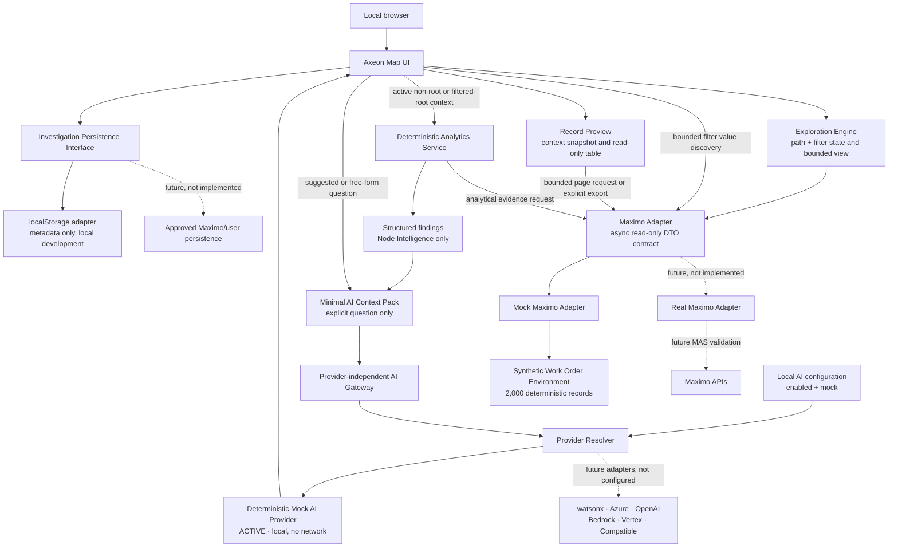

# Development Architecture — Task 014

The Mock Adapter runs locally in the browser build. It returns bounded aggregate DTOs, at most 20 preview records per page plus a separate total count, and an all-matching CSV only on explicit export. Analytical evidence is requested only for the active Node Intelligence context when required. Task 013 reuses the resulting structured findings and selected-node count; it sends no raw Work Order collection to the Mock AI Provider. The persistence interface stores committed path/filter metadata, not evidence, findings, Context Packs, answers, or UI state. The future Real Adapter, Maximo API path, enterprise persistence and approved server-side AI provider are not implemented. The scope marker does not enforce authorization in mock mode. AX-DEP-001 remains the deployment target.

Task 014 places a safe configuration and provider resolver between the provider-independent gateway and Mock. Only Mock is executable locally; every named production integration is not configured. Disabled/unavailable routing sends no provider request and does not change exploration or deterministic analytics. No provider secret, endpoint or response payload enters persistence. AX-DEP-001 remains unvalidated in MAS.

## Task 016 context extension

Task 016 extends the structured context and adapter DTOs with normalized filters. The same path, filters, and current-user marker feed map aggregates, analytical evidence, Context Packs, record pages, CSV export, persistence resume, and reports. `filterValues` returns bounded distinct values/counts; no raw dataset enters React. localStorage remains metadata-only.

## Task 017 adapter readiness

Task 017 adds explicit adapter configuration/resolution, capability and availability metadata, normalized domain DTOs, centralized bounds, typed safe errors, and a fail-closed Real Adapter port. The Real port executes no data access. The Mock Adapter remains the sole synthetic-data owner and the reusable contract suite is intended for future authorized Real Adapter validation.

## Task 018 release identity

Task 018 identifies the local build as `1.0.0-dev` through package metadata and a typed release view. No build timestamp is generated, so builds and tests remain stable. Safe diagnostic metadata combines release, selected adapter profile, AI provider identity/status, and the development security marker without storage, logging, or transmission.

## Task 019 report runtime

The development build has two bootstrap surfaces in the same bundle: normal hashes render `App`; `#/report/{mode}/{opaqueId}` renders `ReportWindowApp` only. The source tab opens the target synchronously, builds the existing bounded report asynchronously, writes a schema-v1 snapshot into the target's `sessionStorage`, then advances the target from `preparing` to `ready`. No router, state-management package, network transfer, or server PDF service was added.

Snapshots use the `axeon:report-snapshot:` namespace and an `axeon:report-snapshots:index` cleanup index. Local bounds are 256 KiB, 30 minutes, and six indexed entries. These are continuity and storage-hygiene controls, not authorization. Browser refresh of the original app still resets unsaved active investigation state; full active-session recovery and cross-tab state synchronization remain post-V1 work.

## Task 020 local security controls

The development shell retains only fictitious data. Its structured logger records allowlisted metadata, while report and persistence validation reject malformed local state. These controls are described in [security documentation](../security/axeon-security-and-data-protection.md); they do not replace Real Adapter authorization or a production audit service.
