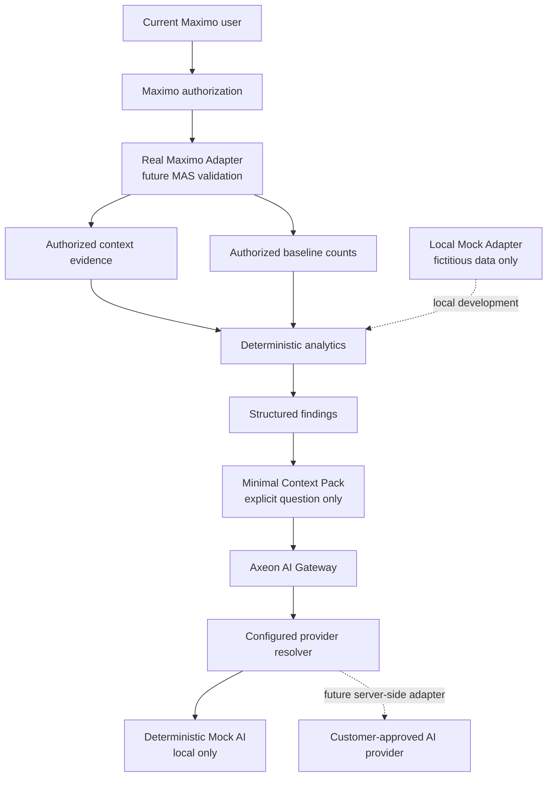

# Security architecture — analytical evidence boundary

Authorization must precede analytical calculation and AI packaging. Filtering findings or AI output after analyzing wider data would expose unauthorized counts or patterns. All eight detectors consume the same already-scoped evidence request; baselines and concentration populations must have the same authorized boundary. The minimal Context Pack is built from that active structured context and its findings only. The Mock Adapter's current-user marker is developmental and does not enforce Maximo security.

A future provider flow is **Browser → Axeon AI Gateway → approved server-side provider integration**. Provider credentials, public provider endpoints and secrets must not enter browser-delivered code. Maximo and user text is untrusted data, never provider instruction; future system instructions must reject prompt injection embedded in operational fields. Context Packs and responses are not logged or stored by the local implementation and are excluded from Saved/Recent metadata. MAPPERADMIN remains Maximo configuration, never a code bypass. AX-DEP-001 and authorized MAS/provider validation remain mandatory.

Task 014 adds a configuration resolver between the gateway and provider adapters. Configuration contains no secret values. Unconfigured providers fail closed and cannot fall back to Mock. Compatible-provider destinations must be administrator configured, TLS protected and allow-listed; arbitrary user-entered endpoints are prohibited. Provider choice cannot bypass authorization, expand the Context Pack, weaken grounding, or enable Maximo queries/writes. The browser must never receive the provider secret.

Task 015 report generation preserves the same authorization ordering: authorized aggregates and authorized deterministic findings must exist before report rendering. The local `current-user` marker and synthetic provenance are displayed but are not claimed as enforcement. The report builder accepts no query language, credentials, arbitrary endpoint, raw record collection or HTML. React text rendering treats labels as untrusted data. Reports are not persisted, and browser Print/Save PDF is an explicit user-controlled output that may create a local file under the user's device/browser controls.

Task 016 adds filters only after the authorization boundary: **Maximo authorization → authorized population → path → filters → Axeon capability**. A filter cannot broaden scope. Filter discovery must be authorized and aggregate/bounded. A future Real Adapter applies authorization before or together with path/filter evaluation. Filter metadata contains no credentials or records and grants no access; resume revalidates it. No query language or generated SQL is exposed.

## Adapter authorization boundary (Task 017)

Every adapter request now carries the selected adapter's explicit security context. The development marker identifies Mock intent only. A Real Adapter must use the current Maximo session and authorize before returning counts, filter values, evidence, records, exports, or report aggregates. Missing/mismatched scope, invalid context, unsupported capability, and unconfigured Real integration fail closed. Safe errors omit endpoints, SQL, credentials, response bodies, and stack details; there is no Real-to-Mock fallback.

## Report snapshot boundary (Task 019)

The standalone report receives an already bounded report model containing only the exact represented context and its authorized-boundary aggregates/findings. Transfer is same-origin and session-scoped. A unique opaque key appears in the hash; report content, path/filter values, evidence, AI text, and scope metadata do not. The serialized envelope is namespaced, schema-versioned, size-bounded, time-limited, and validated before rendering. It never includes raw Work Order collections, credentials, tokens, provider secrets, Maximo passwords, SQL, or endpoints.

The report snapshot is a presentation handoff, not authorization or a new data source. Future Real Adapter authorization still occurs before report aggregates and findings enter the model. Invalid, absent, expired, oversized, or unsupported snapshots fail closed without a root fallback. Clearing the opener reference reduces unnecessary cross-window coupling; report Close does not navigate or mutate the Axeon source tab.

## V1 data-protection and logging controls (Task 020)

The governing invariant is: **Axeon must never retrieve, analyze, display, export, report, persist, log, or send to AI data that the current Maximo user is not authorized to access.** The trust chain is authenticated user, Maximo authentication, Maximo authorization, authorized APIs/Object Structures, Real Adapter, normalized bounded DTOs, Axeon capabilities, then an optional minimized Context Pack. Every retained client object is untrusted metadata, never authorization.

`support/logger.ts` emits allowlisted technical/security metadata only. It records no Work Order values, paths, filters, findings, AI content, raw errors, credentials, endpoints, SQL, or Maximo payload. Report snapshots and local persistence validate schema/shape/size and reject corrupt content safely. See [security controls](../security/axeon-security-and-data-protection.md) and the [logging standard](../security/axeon-logging-standard.md).

## V1.1 server authorization boundary

The planned self-hosted server must authenticate the caller before any data-bearing route, resolve only an approved object profile, and apply Maximo authorization before returning normalized bounded Axeon DTOs. A read-only Db2 or SQL Server connection is a separate technical restriction; it cannot be treated as proof of the current user's Maximo authorization. Database credentials and AI-provider secrets remain server-side. See the [V1.1 baseline](v1.1-architecture-baseline.md).

## AX-022 server controls

The foundation exposes only a public health route and static browser assets. It has no data route and no authentication bypass. Future protected operations use `requireAuthenticatedPrincipal` before object profile or adapter work. The configuration loader accepts safe references rather than credential values, the registry rejects query-bearing configuration, static path traversal is rejected, request bodies are bounded, and API errors disclose no internal configuration.
