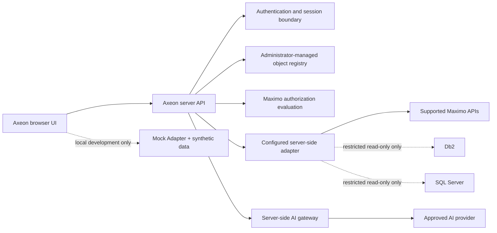

# V1.1 architecture baseline

## Purpose

V1.1 prepares Axeon Map for a self-hosted browser application with a server-side boundary. It preserves the V1 investigation UI, Mock Adapter, synthetic dataset, bounded contracts, deterministic analytics, reports, and provider-independent AI contracts. This baseline introduces no network service, database connection, authentication implementation, administration UI, or Maximo integration.

## Target boundary

The browser continues to use Axeon-defined, capability-oriented DTOs. It never receives database credentials, provider secrets, raw database access, Maximo session credentials, unrestricted query syntax, or administrator configuration secrets.

## Server responsibilities

The future Axeon server owns configuration loading, authentication/session enforcement, object-registry evaluation, authorized adapter selection, Maximo API access, restricted read-only database access where approved, audit/technical logging, export policy, and provider communication. It validates every request before an adapter call and returns only normalized, bounded Axeon DTOs.

The server must fail closed when it cannot authenticate the caller, resolve a permitted object, establish an approved connection, confirm capability, or evaluate authorization. It must not fall back from a configured production adapter to Mock.

## AX-022 implemented foundation

`app/server/` now provides the first server executable using native Node.js HTTP APIs. It serves the built React application, exposes only `GET /api/v1/health`, applies consistent JSON errors, request-size limits, basic security headers, path containment for static assets, and graceful close primitives. No data route, connection, identity, or provider route exists. Requests under `/api/` other than health return a safe unavailable response.

The server configuration loader accepts validated non-secret runtime settings and safe server-side reference names only. It declares future Db2, SQL Server, Maximo, and AI settings without implementing them or including credential fields. The principal and authorization interfaces make missing authentication an explicit failure before future object resolution or adapter execution.

The server-owned object-profile registry validates approved metadata for Work Orders, Service Requests, Incidents, Assets, and future custom objects. Profiles enumerate allowed normalized fields and capabilities; they reject query, SQL, endpoint, connection-string, credential, and secret configuration keys. No profile grants Maximo permissions.

## Data access and authorization

Read-only Db2 or SQL Server credentials restrict what the server connection can do. They do **not** establish Maximo user-specific authorization. Before Axeon returns counts, records, findings, exports, reports, or AI Context Pack data, it must enforce the current user’s applicable Maximo authorization through an approved integration design. The future implementation must demonstrate this separately for Maximo API and any approved database-read path.

No UI component, AI provider, or generated prompt may create SQL. Database support is limited to parameterized, reviewed server-side operations generated from approved object profiles and bounded capability requests. The exact Maximo authorization propagation strategy remains unresolved until supported APIs and customer security configuration are validated.

## Object registry

The future administrator-managed registry defines approved investigative objects rather than exposing arbitrary tables. Initial registry candidates are Work Orders, Service Requests, Incidents, and approved custom objects.

Each object profile must contain: stable object ID, display name, enabled status, approved source adapter capability, primary identifier, normalized field mappings, permitted Explore By fields, permitted Filter fields, bounded record-preview/export fields, supported analytical pack, and authorization policy reference. A profile does not contain browser credentials, raw SQL, unrestricted endpoint text, or user-editable connection strings.

The registry controls what Axeon exposes. Maximo security controls what the user may access. Enabling a profile never broadens authorization.

## Authentication sequence

Network deployment requires mandatory authentication before data-bearing API routes are available. The first implementation should establish an Axeon server session bound to an authenticated identity, explicit logout/expiry behavior, CSRF strategy for state-changing administration routes, and server-side authorization handoff. SSO is a later adapter at this authentication boundary; it must not change investigation, adapter, or Context Pack contracts.

Local Mock development remains explicitly unauthenticated and must never be presented as a network-deployment security model.

## AI boundary

The existing browser Context Pack contract remains semantic and provider-independent. The server rebuilds or validates a minimal authorized Context Pack after authorization, sends it only to an approved configured provider, and keeps credentials server-side. Deterministic analytics remain authoritative for calculated facts. AI has no Maximo/database connection and cannot perform write actions.

## Proposed implementation sequence

1. Define server API request/response contracts that reuse the current normalized adapter DTOs and add authenticated principal context.
2. Implement mandatory authentication/session middleware before exposing any network data API.
3. Implement a validated object-registry configuration model and a server-only registry reader; do not build administration UI yet.
4. Add a server-side adapter resolver and Mock-through-server development path, preserving existing browser behavior.
5. Validate one authorized read-only Maximo API adapter in an approved environment before any direct database path.
6. Add restricted read-only Db2/SQL Server adapters only with a reviewed authorization strategy, parameterized queries, least-privilege accounts, limits, and audit controls.
7. Move provider communication to the server gateway after authentication and authorization boundaries are proven.

## Dependencies and unresolved decisions

Task 022 needs a server runtime/framework, configuration and secret-management approach, authentication/session strategy, approved deployment topology, audit-log destination, object-registry storage/governance, Maximo authorization propagation design, supported API/Object Structure discovery, customer Work Type/analytical mapping policy, and database driver choice for Db2 and SQL Server. None is selected or added in Task 021.

The target continues to respect AX-DEP-001. Compatibility with supported Maximo Manage Application Configuration/MAF remains to be tested in an authorized environment; this baseline makes no production or MAS certification claim.
