# Axeon Map security and data protection

## V1 security invariant

**Axeon must never retrieve, analyze, display, export, report, persist, log, or send to AI data that the current Maximo user is not authorized to access.**

Local development demonstrates this boundary with a fictitious Mock Adapter and a `development-marker`. That marker is not Maximo authorization and must never be represented as such.

## Trust chain

```mermaid
flowchart LR
  User[Authenticated Maximo user] --> Auth[Maximo authentication]
  Auth --> Authorize[Maximo authorization]
  Authorize --> APIs[Authorized APIs / Object Structures]
  APIs --> Adapter[Real Maximo Adapter]
  Adapter --> Data[Normalized and bounded data]
  Data --> Axeon[Counts, records, findings, report and export]
  Axeon --> Pack[Minimal optional AI Context Pack]
  Pack --> Gateway[Approved server-side AI gateway]
```

Authorization occurs before or during each retrieval. React must never receive a wider population and hide it later. A persisted path, filter, report snapshot, or AI response does not grant data access.

## Data minimization lifecycle

| Stage | Data allowed | Bound or rule |
| --- | --- | --- |
| Exploration | authorized aggregate groups | 16 visible groups |
| Filter discovery | authorized distinct aggregates | 50 values per dimension |
| Record preview | preview DTO fields only | 20 records per page |
| Export | explicit authorized export DTO | separate from preview; CSV formula-safe |
| Analytics | authorized analytical evidence | one context request; no startup-wide analysis |
| Report | bounded aggregates/findings and eligible exact-context AI answer | no raw Work Order collection |
| AI | context, population, concise findings, scope marker, question | no records, saved state, credentials, or unrelated branches |
| Saved/Recent | structured committed path and filters | metadata only; local development storage only |
| Report handoff | bounded schema-validated report model | same-origin session snapshot, 30-minute lifetime, six snapshots |

Browser storage is not an authorization boundary. Saved/Recent uses localStorage key `axeon-map-investigations-v1`; report snapshots use namespaced sessionStorage. Neither may contain credentials, raw evidence/records, exports, Context Packs, AI answers, or tokens. Corrupt or invalid retained state fails closed.

## Input, output, and export safety

Maximo labels, descriptions, classifications, locations, asset text, saved names, filters, and questions are untrusted data. React renders text without HTML injection mechanisms. Context Packs preserve untrusted text as data; future provider system instructions must reject instructions embedded in operational text.

CSV quotes fields and prefixes formula-like values beginning with whitespace followed by `=`, `+`, `-`, or `@` with an apostrophe. A future Real Adapter must still authorize the full export before it is generated.

## Error and diagnostics policy

UI errors use safe, generic messages. They do not expose SQL, endpoints, Maximo payloads, stack traces, credentials, tokens, or raw operational records. Technical diagnostics use the allowlisted structured logging standard; browser logging is a local-development diagnostic aid, not an audit log.

## Production requirements still to validate

A Real Adapter must bind every request to the current Maximo session, enforce authorization for each operation, normalize customer values, and be exercised against roles with different authorized populations. Production AI credentials and communication remain server-side. AX-DEP-001 remains a deployment target until tested in an authorized MAS environment.
